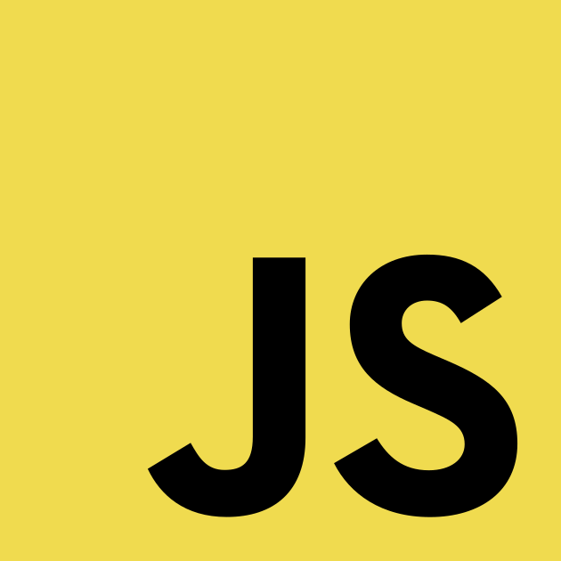
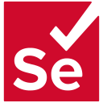
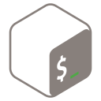

<!--
**BryanJames16/BryanJames16** is a ✨ _special_ ✨ repository because its `README.md` (this file) appears on your GitHub profile.
-->
### Hi There 👋 Welcome!

### 👨‍💻 About Me

Hi! ✋ My name is **Bryan James** from Rizal, Philippines. Currently working as DevOps 💻.

With 7 years in tech field and leader in IT operations, I often find myself in communities 🏢, blog posts 📜, and tech forums 💻 continuously burning my enthusiasm with new and relevant technologies! I am passionate with anything about technology, especially with anything regarding cloud native ☁, DevOps 🚢, and observability 📡.

Aside from what's mentioned above, mediation 🙏, reading 📖, coding 👨‍💻, and travel ✈ are my favorite hobbies. I really love long train rides 🚂.

Let's connect!

<!-- Profile Badges -->
<div id="profile-badges" align="center">
  <a href="https://www.linkedin.com/in/bryan-james-ilaga-4b1b478b/"></a>&nbsp;
  <a href="https://github.com/BryanJames16/"></a>&nbsp;
  <a href="https://www.credly.com/users/bryan-james-ilaga/badges"></a>
</div>

---

- 🔭 I’m currently working on **personal** and **open-source projects**
- 🌱 I’m currently learning **Rust, React, Cloud, and AI**
- 😄 Pronouns: He / Him / His

---

### 🚀 Skills

- 💻 **DevOps** - Pipeline, Automation, Observability, Continuous Integration, Delivery, and Deployment. 
- 📔 **ITIL** - IT Service Management and Operations, Event Management, Incident Management.
- ⌨ **Full-Stack Development** - Front-End, Back-End, and Software Quality Assurance.
- ⛅ **Cloud** - Amazon Web Services (AWS) and Google Cloud Platform (GCP).
- 🌕 **Leadership** - Vendor and Resource Management, Cost Management, and Role Profiling.

---

### 🛠 Tools
#### Full Stack Development
<div>
  <a href="https://dotnet.microsoft.com"></a>&nbsp;
  <a href="https://cplusplus.com"></a>&nbsp;
  <a href="https://learn.microsoft.com/en-us/dotnet/csharp/"></a>&nbsp;
  <a href="https://www.java.com"></a>&nbsp;
  <a href="https://www.python.org"></a>&nbsp;
  <a href="https://www.rust-lang.org"></a>&nbsp;
  <a href="https://laravel.com"></a>&nbsp;
  <a href="https://en.wikipedia.org/wiki/HTML5"></a>&nbsp;
  <a href="https://en.wikipedia.org/wiki/CSS"></a>&nbsp;
  <a href="https://en.wikipedia.org/wiki/JavaScript"></a>&nbsp;
  <a href="https://www.typescriptlang.org"></a>&nbsp;
  <a href="https://nodejs.org"></a>&nbsp;
  <a href="https://react.dev"></a>&nbsp;
  <a href="https://jquery.com"></a>&nbsp;
  <a href="https://getbootstrap.com"></a>&nbsp;
  <a href="https://www.selenium.dev"></a>&nbsp;
</div>

#### DevOps
<div>
  <a href="https://git-scm.com"></a>&nbsp;
  <a href="https://github.com"></a>&nbsp;
  <a href="https://gitlab.com"></a>&nbsp;
  <a href="https://www.docker.com"></a>&nbsp;
  <a href="https://kubernetes.io"></a>&nbsp;
  <a href="https://opentofu.org/"></a>&nbsp;
  <a href="https://argoproj.github.io/cd"></a>&nbsp;
  <a href="https://www.appdynamics.com"></a>&nbsp;
  <a href="https://www.splunk.com/"></a>&nbsp;
  <a href="https://grafana.com"></a>&nbsp;
  <a href="https://prometheus.io"></a>&nbsp;
  <a href="https://opentelemetry.io"></a>&nbsp;
  <a href="https://www.bugzilla.org"></a>&nbsp;
  <a href="https://www.atlassian.com/software/jira"></a>&nbsp;
  <a href="https://www.atlassian.com/software/confluence"></a>&nbsp;
  <a href="https://www.atlassian.com/software/bitbucket"></a>&nbsp;
</div>

#### Cloud
<div>
  <a href="https://aws.amazon.com"></a>&nbsp;
  <a href="https://cloud.google.com"></a>&nbsp;
</div>

#### Data
<div>
  <a href="https://www.mysql.com"></a>&nbsp;
  <a href="https://en.wikipedia.org/wiki/Microsoft_SQL_Server"></a>&nbsp;
  <a href="https://www.sqlite.org"></a>&nbsp;
  <a href="https://jupyter.org/hub"></a>&nbsp;
</div>

#### Miscellaneous
<div>
  <a href="https://www.microsoft.com/en-ph/windows"></a>&nbsp;
  <a href="https://github.com/torvalds/linux"></a>&nbsp;
  <a href="https://www.redhat.com/en/technologies/linux-platforms/enterprise-linux"></a>&nbsp;
  <a href="https://code.visualstudio.com"></a>&nbsp;
  <a href="https://www.adobe.com/products/photoshop.html"></a>&nbsp;
  <a href="https://www.darktable.org"></a>&nbsp;
  <a href="https://www.mozilla.org/en-US/firefox"></a>&nbsp;
  <a href="https://www.google.com/intl/en_ph/chrome/"></a>&nbsp;
  <a href="https://en.wikipedia.org/wiki/Bash_(Unix_shell)"></a>&nbsp;
  <a href="https://www.markdownguide.org"></a>&nbsp;
</div>

---

<details>
  <summary><b>💹 Stats</b></summary>
  <br />

[](https://github.com/antonkomarev/github-profile-views-counter)

[](https://git.io/streak-stats) [](https://github.com/anuraghazra/github-readme-stats)

[](https://github.com/ryo-ma/github-profile-trophy)
</details>

<details>
  <summary><b>📦 More</b></summary>
  <br />

[](https://github.com/ABSphreak/readme-jokes)
</details>

---

<!-- Added necessary comments -->
```
████████╗██╗░░██╗░█████╗░███╗░░██╗██╗░░██╗
╚══██╔══╝██║░░██║██╔══██╗████╗░██║██║░██╔╝
░░░██║░░░███████║███████║██╔██╗██║█████═╝░
░░░██║░░░██╔══██║██╔══██║██║╚████║██╔═██╗░
░░░██║░░░██║░░██║██║░░██║██║░╚███║██║░╚██╗
░░░╚═╝░░░╚═╝░░╚═╝╚═╝░░╚═╝╚═╝░░╚══╝╚═╝░░╚═╝
░░░░░░██╗░░░██╗░█████╗░██╗░░░██╗██╗░░░░░░░
░░░░░░╚██╗░██╔╝██╔══██╗██║░░░██║██║░░░░░░░
░░░░░░░╚████╔╝░██║░░██║██║░░░██║██║░░░░░░░
░░░░░░░░╚██╔╝░░██║░░██║██║░░░██║╚═╝░░░░░░░
░░░░░░░░░██║░░░╚█████╔╝╚██████╔╝██╗░░░░░░░
░░░░░░░░░╚═╝░░░░╚════╝░░╚═════╝░╚═╝░░░░░░░
```

<!--
Icons to be fixed: 
- None 

Skills to be added:
- None
-->

<!-- 

░██████╗░░█████╗░░█████╗░██████╗░  ██╗░░░░░██╗░░░██╗░█████╗░██╗░░██╗██╗
██╔════╝░██╔══██╗██╔══██╗██╔══██╗  ██║░░░░░██║░░░██║██╔══██╗██║░██╔╝██║
██║░░██╗░██║░░██║██║░░██║██║░░██║  ██║░░░░░██║░░░██║██║░░╚═╝█████═╝░██║
██║░░╚██╗██║░░██║██║░░██║██║░░██║  ██║░░░░░██║░░░██║██║░░██╗██╔═██╗░╚═╝
╚██████╔╝╚█████╔╝╚█████╔╝██████╔╝  ███████╗╚██████╔╝╚█████╔╝██║░╚██╗██╗
░╚═════╝░░╚════╝░░╚════╝░╚═════╝░  ╚══════╝░╚═════╝░░╚════╝░╚═╝░░╚═╝╚═╝
-->
